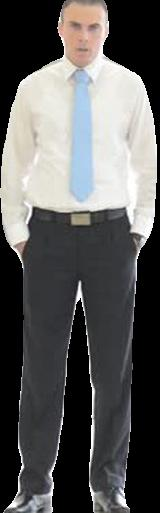

# Body-Detection-With-BG-Removal
This Web App is used to detect human bodies from the image and then extract the human bodies and apply BG removal technique to get just a human body without any kind of background.

## Prerequisite
```
tensorflow
numpy  
scipy
opencv-python
pillow
matplotlib
h5py
keras
Flask
```

## Installation

you can install all the above mentioned requirements using pip3.

### 1: imageai - Python library developed for object detection. 

Refer the installation process here ---> [here](https://imageai.readthedocs.io/en/latest/index.html)

All the prerequisites are mentioned above please install it before installing imageai.

use this command for installation of imageai:
```
pip3 install imageai --upgrade
```

I have used YoloV3 for object detection, you can use Retinanet or yolo-tiny which are also trained for it.

To download yolov3/Retinanet/yolo-tiny: [here](https://github.com/OlafenwaMoses/ImageAI/releases/tag/1.0/)

### 2: Xception Model: used to remove the background of the image

use this command to download Xception model:
```
wget http://download.tensorflow.org/models/deeplabv3_pascal_train_aug_2018_01_04.tar.gz
```

Make sure to add these models into "static/models/(your_model_folder)" folder to run the main script.

## Output Example

Body Detection  | Image with BG   | Image w/o BG
--------------  | -------------   | ------------
  |  | 
  |  | 
  |  | 
  |  | 
  |  | 
